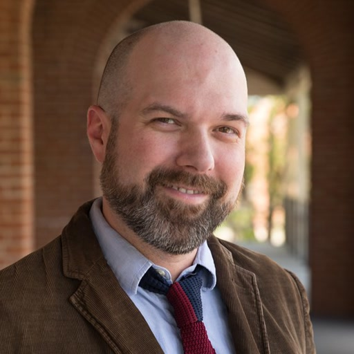

::: {.hero-section}
# CyberAI Educator Workshop

**CORE Center at UA Little Rock · July 29-30, 2026**

Two days of practical professional development on AI in the classroom. What the tools
can do, where they fail, how to teach with them honestly, and how cybersecurity clinics
are putting them to work.
:::

::: {.stats-bar}
::: {.stat}
[2]{.stat-number}[Days]{.stat-label}
:::
::: {.stat}
[14]{.stat-number}[Sessions]{.stat-label}
:::
::: {.stat}
[5]{.stat-number}[Presenters]{.stat-label}
:::
::: {.stat}
[3]{.stat-number}[Clinic Models]{.stat-label}
:::
:::

::: {.draft-note}
**Preview for presenters, not yet for participants.** This is here so Paul, Rob, Sandra and
Kyle can see the shape of it and fill the gaps. Anything marked *tktk* is a question waiting
on someone — mostly presenter names for Day 1, and the venue details. Sessions gain a
materials link once a presenter supplies something. Two things need a decision rather than
just information: the Day 1 afternoon timings (see the note under that schedule), which don't
currently add up, and whether the closing discussion needs a feedback form on the site.
Send anything to [ryanstraight@arizona.edu](mailto:ryanstraight@arizona.edu).
:::

## Overview {#overview}

This workshop brings together classroom educators and cybersecurity clinic practitioners
for two days.

**Day 1** stays in the classroom. It works through what large language models actually
are and aren't, and the ethics and academic-integrity questions that follow. From there it
turns practical: lesson planning, feedback, differentiation, and accessibility. The day
closes with what participants still need.

**Day 2** turns to cybersecurity clinics: the experiential-learning model behind them, how
AI is being integrated into that model, and how three states are running clinics of their
own. The afternoon is a hands-on tabletop exercise built on Clinic-in-a-Box.

Materials are posted here as presenters supply them, and they stay up after the
workshop.

## Day 1 {#day-1}

::: {.day-heading}
## Day 1: AI in the Classroom
[Wednesday, July 29, 2026]{.day-date}
:::

::: {.day-shape}
The morning builds the foundation: what the tools are, then the ethics and integrity
questions that follow from it. The afternoon is classroom practice, and the day ends by
asking what you still need.
:::

```{=html}
<div class="tl">
<div class="tl-row">
  <div class="tl-when"><span class="tl-time">8:30</span><span class="tl-dur">30 min</span></div>
  <div class="tl-card">
    <h3>Arrival &amp; networking</h3>
    <p class="tl-gloss">Coffee and light refreshments</p>
  </div>
</div>
<div class="tl-row">
  <div class="tl-when"><span class="tl-time">9:00</span><span class="tl-dur">30 min</span></div>
  <div class="tl-card is-overview">
    <div><span class="tl-num">Session 1</span> <span class="tl-type t-overview">Overview</span></div>
    <h3>Introductions and PD overview</h3>
    <p class="tl-who">tktk</p>
  </div>
</div>
<div class="tl-row">
  <div class="tl-when"><span class="tl-time">9:30</span><span class="tl-dur">60 min</span></div>
  <div class="tl-card">
    <div><span class="tl-num">Session 2</span></div>
    <h3>AI foundations: what teachers need to know</h3>
    <p class="tl-gloss">Large language models, what they can and can't do, and the misconceptions that get in the way</p>
    <p class="tl-who">tktk</p>
  </div>
</div>
<div class="tl-gap"><span class="tl-gap-time">10:30</span><span class="tl-gap-label">10 min break</span></div>
<div class="tl-row">
  <div class="tl-when"><span class="tl-time">10:40</span><span class="tl-dur">45 min</span></div>
  <div class="tl-card">
    <div><span class="tl-num">Session 3</span></div>
    <h3>AI ethics, bias &amp; academic integrity</h3>
    <p class="tl-gloss">Limits of plagiarism detection, equity concerns, responsible-use and AI policies</p>
    <p class="tl-who"><a href="#ryan-straight">Ryan Straight</a></p>
  </div>
</div>
<div class="tl-gap is-meal"><span class="tl-gap-time">11:25</span><span class="tl-gap-label">Lunch, 70 min</span></div>
<div class="tl-row">
  <div class="tl-when"><span class="tl-time">12:45</span><span class="tl-dur">60 min</span></div>
  <div class="tl-card">
    <div><span class="tl-num">Session 4</span></div>
    <h3>Lesson planning, content creation, feedback and grading</h3>
    <p class="tl-gloss">Rubrics, worksheets, differentiated materials, and drafting feedback that still says something</p>
    <p class="tl-who">tktk</p>
  </div>
</div>
<div class="tl-gap"><span class="tl-gap-time">1:45</span><span class="tl-gap-label">10 min break</span></div>
<div class="tl-row">
  <div class="tl-when"><span class="tl-time">1:55</span><span class="tl-dur">40 min</span></div>
  <div class="tl-card">
    <div><span class="tl-num">Session 5</span></div>
    <h3>Teaching students to use AI responsibly</h3>
    <p class="tl-gloss">Prompt literacy and critical evaluation of AI output</p>
    <p class="tl-who">tktk</p>
  </div>
</div>
<div class="tl-gap"><span class="tl-gap-time">2:35</span><span class="tl-gap-label">10 min break</span></div>
<div class="tl-row">
  <div class="tl-when"><span class="tl-time">2:45</span><span class="tl-dur">see note</span></div>
  <div class="tl-card">
    <div><span class="tl-num">Session 6</span></div>
    <h3>Personalized learning &amp; accessibility</h3>
    <p class="tl-gloss">Adaptive supports, ELL and IEP accommodations</p>
    <p class="tl-who">tktk</p>
  </div>
</div>
<div class="tl-gap"><span class="tl-gap-time">3:25</span><span class="tl-gap-label">10 min break</span></div>
<div class="tl-row">
  <div class="tl-when"><span class="tl-time">3:35</span><span class="tl-dur">40 min</span></div>
  <div class="tl-card">
    <div><span class="tl-num">Session 7</span></div>
    <h3>Closing discussion</h3>
    <p class="tl-gloss">What did you learn, what would you like to learn, what do you need</p>
    <p class="tl-who">tktk</p>
  </div>
</div>
<div class="tl-row">
  <div class="tl-when"><span class="tl-time">4:15</span><span class="tl-dur">15 min</span></div>
  <div class="tl-card">
    <h3>Daily wrap-up and Q&amp;A</h3>
  </div>
</div>
</div>
```

::: {.draft-note}
**Day 1 afternoon timings need a fix before this is published.** Taking the agenda as
written: Session 6 runs 2:45-3:50 (65 minutes, labeled 45), the following break sits at
3:25-3:35 *inside* it, and Session 7 starts at 3:35 while Session 6 is still running.
Sessions 5 and 7 are also each 40 minutes against a 45-minute label. Separately,
lunch ends at 12:35 and Session 4 starts at 12:45, leaving 10 minutes unaccounted for. The likeliest intent is
Session 6 at 2:45-3:25, break 3:25-3:35, Session 7 at 3:35-4:15 — which resolves every
conflict — but that is a reconstruction, not a correction, and needs Paul or Rob to confirm.
Day 2 is internally consistent throughout.
:::

## Day 2 {#day-2}

::: {.day-heading}
## Day 2: Cybersecurity Clinics and Clinic-in-a-Box
[Thursday, July 30, 2026]{.day-date}
:::

::: {.day-shape}
The morning is context: how clinics work, how AI fits, and how three states run them. The
whole afternoon is one hands-on tabletop exercise in three parts.
:::

```{=html}
<div class="tl">
<div class="tl-row">
  <div class="tl-when"><span class="tl-time">8:30</span><span class="tl-dur">30 min</span></div>
  <div class="tl-card">
    <h3>Arrival &amp; networking</h3>
    <p class="tl-gloss">Coffee and light refreshments</p>
  </div>
</div>
<div class="tl-row">
  <div class="tl-when"><span class="tl-time">9:00</span><span class="tl-dur">30 min</span></div>
  <div class="tl-card is-overview">
    <div><span class="tl-num">Session 1</span> <span class="tl-type t-overview">Overview</span></div>
    <h3>Level setting</h3>
    <p class="tl-gloss">Experiential learning, the Consortium of Cybersecurity Clinics, and K-12 clinics</p>
    <p class="tl-who"><a href="#paul-wagner">Paul Wagner</a> · <a href="#rob-honomichl">Rob Honomichl</a></p>
  </div>
</div>
<div class="tl-row">
  <div class="tl-when"><span class="tl-time">9:30</span><span class="tl-dur">15 min</span></div>
  <div class="tl-card">
    <div><span class="tl-num">Session 2</span></div>
    <h3>AI integration for clinics</h3>
    <p class="tl-who"><a href="#rob-honomichl">Rob Honomichl</a></p>
  </div>
</div>
<div class="tl-gap"><span class="tl-gap-time">9:45</span><span class="tl-gap-label">15 min break</span></div>
<div class="tl-row">
  <div class="tl-when"><span class="tl-time">10:00</span><span class="tl-dur">60 min</span></div>
  <div class="tl-card is-panel">
    <div><span class="tl-num">Session 3</span> <span class="tl-type t-panel">Panel</span></div>
    <h3>Arizona, Arkansas and South Dakota clinic models</h3>
    <p class="tl-gloss">Ten minutes per model, then Q&amp;A</p>
    <p class="tl-who"><a href="#paul-wagner">Paul Wagner</a> · <a href="#rob-honomichl">Rob Honomichl</a> · <a href="#sandra-leiterman">Sandra Leiterman</a> · <a href="#kyle-cronin">Kyle Cronin</a></p>
  </div>
</div>
<div class="tl-gap"><span class="tl-gap-time">11:00</span><span class="tl-gap-label">10 min break</span></div>
<div class="tl-row">
  <div class="tl-when"><span class="tl-time">11:10</span><span class="tl-dur">50 min</span></div>
  <div class="tl-card">
    <div><span class="tl-num">Session 4</span></div>
    <h3>Clinic-in-a-Box: introduction</h3>
    <p class="tl-who"><a href="#paul-wagner">Paul Wagner</a></p>
  </div>
</div>
<div class="tl-gap is-meal"><span class="tl-gap-time">12:00</span><span class="tl-gap-label">Lunch, 75 min</span></div>
<div class="tl-row">
  <div class="tl-when"><span class="tl-time">1:15</span><span class="tl-dur">45 min</span></div>
  <div class="tl-card is-handson">
    <div><span class="tl-num">Session 5</span> <span class="tl-type t-handson">Tabletop</span></div>
    <h3>Clinic-in-a-Box tabletop exercise, part 1</h3>
    <p class="tl-who"><a href="#paul-wagner">Paul Wagner</a></p>
  </div>
</div>
<div class="tl-gap"><span class="tl-gap-time">2:00</span><span class="tl-gap-label">10 min break</span></div>
<div class="tl-row">
  <div class="tl-when"><span class="tl-time">2:10</span><span class="tl-dur">45 min</span></div>
  <div class="tl-card is-handson">
    <div><span class="tl-num">Session 6</span> <span class="tl-type t-handson">Tabletop</span></div>
    <h3>Clinic-in-a-Box tabletop exercise, part 2</h3>
    <p class="tl-who"><a href="#paul-wagner">Paul Wagner</a></p>
  </div>
</div>
<div class="tl-gap"><span class="tl-gap-time">2:55</span><span class="tl-gap-label">10 min break</span></div>
<div class="tl-row">
  <div class="tl-when"><span class="tl-time">3:05</span><span class="tl-dur">45 min</span></div>
  <div class="tl-card is-handson">
    <div><span class="tl-num">Session 7</span> <span class="tl-type t-handson">Tabletop</span></div>
    <h3>Clinic-in-a-Box tabletop exercise, part 3</h3>
    <p class="tl-who"><a href="#paul-wagner">Paul Wagner</a></p>
  </div>
</div>
<div class="tl-row">
  <div class="tl-when"><span class="tl-time">3:50</span><span class="tl-dur">10 min</span></div>
  <div class="tl-card">
    <h3>Daily wrap-up and closing</h3>
  </div>
</div>
</div>
```

## Presenters {#presenters}

```{=html}
<div class="grid">
```

::: {.g-col-md-6 .g-col-12}
::: {.presenter-card}
```{=html}
<div class="presenter-portrait"></div>
```
::: {.presenter-body}
### Ryan Straight

[Assistant Professor, College of Information Science, University of Arizona.]{.presenter-role}

::: {.presenter-sessions}
[Leads]{.ps-label}
Day 1, Session 3 — AI ethics, bias &amp; academic integrity
:::

[[ryanstraight@arizona.edu](mailto:ryanstraight@arizona.edu) · [ORCID](https://orcid.org/0000-0002-6251-5662)]{.presenter-contact}
:::
:::
:::

::: {.g-col-md-6 .g-col-12}
::: {.presenter-card}
```{=html}
<div class="presenter-portrait"></div>
```
::: {.presenter-body}
### Paul Wagner

[Director of Workforce Development and Professor of Practice, Arizona Cybersecurity Academy, College of Information Science, University of Arizona.]{.presenter-role}

::: {.presenter-sessions}
[Leads]{.ps-label}
Day 2 — Sessions 1, 4, and the three Clinic-in-a-Box tabletop sessions. Panellist, Session 3.
:::
:::
:::
:::

::: {.g-col-md-6 .g-col-12}
::: {.presenter-card}
```{=html}
<div class="presenter-portrait"></div>
```
::: {.presenter-body}
### Rob Honomichl

[Director of Cybersecurity Education and Assistant Professor, Arizona Cybersecurity Academy, College of Information Science, University of Arizona.]{.presenter-role}

::: {.presenter-sessions}
[Leads]{.ps-label}
Day 2 — Sessions 1 and 2. Panellist, Session 3.
:::
:::
:::
:::

::: {.g-col-md-6 .g-col-12}
::: {.presenter-card}
```{=html}
<div class="presenter-portrait"></div>
```
::: {.presenter-body}
### Sandra Leiterman

[Director of Cybersecurity Education and Outreach, CORE (Cyberspace Operations Research and Education), University of Arkansas at Little Rock. *tktk — three titles are in circulation; confirm with her directly*]{.presenter-role}

::: {.presenter-sessions}
[Leads]{.ps-label}
Day 2 — panellist, Session 3, on the Arkansas clinic model. Host institution.
:::
:::
:::
:::

::: {.g-col-md-6 .g-col-12}
::: {.presenter-card}
```{=html}
<div class="presenter-portrait"></div>
```
::: {.presenter-body}
### Kyle Cronin

[Professor, Chair of the Department of Cyber Defense, and Coordinator for Academic Computing, The Beacom College of Computer &amp; Cyber Sciences, Dakota State University.]{.presenter-role}

::: {.presenter-sessions}
[Leads]{.ps-label}
Day 2 — panellist, Session 3, on the South Dakota clinic model.
:::
:::
:::
:::

```{=html}
</div>
```

::: {.callout-note collapse="true"}
## Day 1 sessions 1, 2, 4, 5, 6 and 7

Not yet attributed. The source agenda names a presenter only for Session 3. *tktk*
:::

## Practical information {#practical}

```{=html}
<div class="facts">
  <div class="fact">
    <div class="fact-label"><i class="bi bi-geo-alt-fill" aria-hidden="true"></i> Venue</div>
    <p>CORE Center, University of Arkansas at Little Rock.</p>
    <p><em>tktk — building, room, and parking</em></p>
  </div>
  <div class="fact">
    <div class="fact-label"><i class="bi bi-laptop" aria-hidden="true"></i> Bring</div>
    <p>A laptop. Several sessions are hands-on, and the Day 2 tabletop exercise runs on your own machine.</p>
    <p><em>tktk — any accounts or software needed in advance</em></p>
  </div>
  <div class="fact">
    <div class="fact-label"><i class="bi bi-wifi" aria-hidden="true"></i> Wifi</div>
    <p><em>tktk — guest network and access details</em></p>
  </div>
  <div class="fact">
    <div class="fact-label"><i class="bi bi-cup-hot-fill" aria-hidden="true"></i> Meals</div>
    <p>Coffee and light refreshments on arrival both mornings. Lunch is on the schedule both days.</p>
    <p><em>tktk — provided, or on your own?</em></p>
  </div>
  <div class="fact">
    <div class="fact-label"><i class="bi bi-clock-fill" aria-hidden="true"></i> Hours</div>
    <p>Doors at 8:30 both days. Day 1 ends 4:30, Day 2 ends 4:00.</p>
  </div>
  <div class="fact">
    <div class="fact-label"><i class="bi bi-envelope-fill" aria-hidden="true"></i> Questions</div>
    <p><a href="mailto:ryanstraight@arizona.edu">ryanstraight@arizona.edu</a></p>
  </div>
</div>
```

## About this site {#colophon}

::: {.colophon}
### AI contribution

This site was drafted with AI assistance (Claude). I set the structure, supplied the source
agenda, directed the writing, and reviewed and edited everything here. I'm responsible for
its accuracy. AI was not used to make any decision about a participant, and it isn't used
anywhere in the workshop's research component.

The same statement is on the [disclosure page](resources/ai-disclosure.qmd), because asking
teachers to disclose and not doing it yourself is a bad look.

Session materials are the work of the presenter named on each session, and each presenter
speaks for their own.

[Built with [Quarto](https://quarto.org). Source on GitHub. Contact
[ryanstraight@arizona.edu](mailto:ryanstraight@arizona.edu).]{.colophon-meta}
:::
